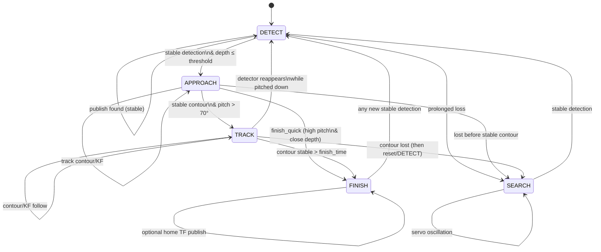

# Object Tracking Robot Report – Draft Outline

## 1. Significance of Assignment (Student Reflection)
- Draft narrative (first person) on why the assignment matters for teamwork and cross-domain problem solving.  
- Current draft:  
  - "In our current world, solutions to difficult problems often come from working together in teams to solve cross-domain problems. When a team is collectively motivated by project of interest then consistent work can lead to new innovation, even if the field seem trivial. Thus an assignment that asks of engineers to consider ideas in general that will please people forces them to think about what could be fun for them but also valuable to society. This balance is a creative problem to solve, but is valuable practice of discussing ideas, formulating strategies and working together towards completion."  
  - "Personally, this assignment was significant in the sense that it granted me the opportunity to work with Japanese collages for the first time."  
- Tighten language around collaboration, motivation, societal value, and cultural experience; keep in first person to satisfy “each student’s thoughts.”

## 2. Technical Significance of the Robot (Student Reflection)
- Describe the role of object tracking and autonomous approach in service contexts (restaurant/bar use-case).  
- Current draft: detection of a bottle held by a person, fast approach to receive it; value in service industry.  
- Expand on integrated components: RF-DETR vision, depth-based contour tracking, LiDAR mapping, navigation stack with obstacle avoidance, voice interface.  
- Add extrapolation to other domains (assistive surgery tools, construction tools) to demonstrate broader impact; keep concise.

## 3. Area of Responsibility (Student Contribution)
- Clarify personal scope and ownership. Suggested sub-sections:
  - **Detection**: What was implemented, tuned, or integrated; metrics achieved.  
  - **Depth Contour Tracking**: How masking/contour/Kalman were used; robustness gains.  
  - (Add any other personal responsibilities: navigation integration, UI/voice interface, testing, deployment.)
- For each, include a short summary of results (what worked, issues, data/metrics if available).

## 4. Summary of Results
- Brief bullets on overall system performance: detection reliability, tracking stability, approach success rate, latency, any demos.  
- Mention qualitative outcomes (e.g., user interaction quality) if quantitative data is limited.

## 5. Lecture Impressions / Learning Reflections
- Personal takeaways from lectures relevant to this assignment (methods learned, tools adopted, perspectives changed). Keep first person.

## 6. Future Work (Optional but helpful)
- Short bullets on next steps: robustness improvements, expanded object classes, better human-robot interaction, safety/validation.

## Notes for Final Report
- Keep sections (d), (e), (f) explicitly satisfied:  
  - (d) Section 1 for assignment significance.  
  - (e) Section 2 for technical significance of the robot.  
  - (f) Section 3 (with summaries) for responsibility and outcomes.  
- Maintain concise, academic tone; first-person where reflecting on personal thoughts; link claims to specific components where possible.

## State Machine Diagram (for inclusion)

Mermaid (Markdown):


LaTeX (TikZ/automata):
```latex
\begin{tikzpicture}[->,>=stealth,node distance=2.8cm,semithick]
  \tikzstyle{state}=[rectangle,rounded corners,draw,align=center,minimum width=22mm]

  \node[state,initial] (detect) {DETECT};
  \node[state,right of=detect] (approach) {APPROACH};
  \node[state,below of=approach] (track) {TRACK};
  \node[state,right of=approach] (finish) {FINISH};
  \node[state,below of=detect] (search) {SEARCH};

  \path (detect) edge[bend left] node[above]{stable det.\\depth $\le$ thr.} (approach)
        (detect) edge[left] node{prolonged loss} (search)
        (detect) edge[loop above] node{publish found (stable)} ();

  \path (approach) edge[bend left] node[above]{stable contour\\pitch $>$ 70°} (track)
        (approach) edge[bend left] node[below]{finish\_quick\\(high pitch, close depth)} (finish)
        (approach) edge[bend right] node[left]{lost before\\stable contour} (search)
        (approach) edge[loop right] node{contour/KF refine} ();

  \path (track) edge[bend left] node[right]{detector\\reappears} (detect)
        (track) edge[bend left] node[left]{contour lost\\(reset, then DETECT)} (search)
        (track) edge node[below]{contour stable\\$>$ finish\_time} (finish)
        (track) edge[loop right] node{contour/KF follow} ();

  \path (search) edge[bend left] node[left]{stable detection} (detect)
        (search) edge[loop left] node{servo oscillation} ();

  \path (finish) edge[bend left] node[above]{new stable\\detection} (detect)
        (finish) edge[loop right] node{home TF (optional)} ();
\end{tikzpicture}
```
