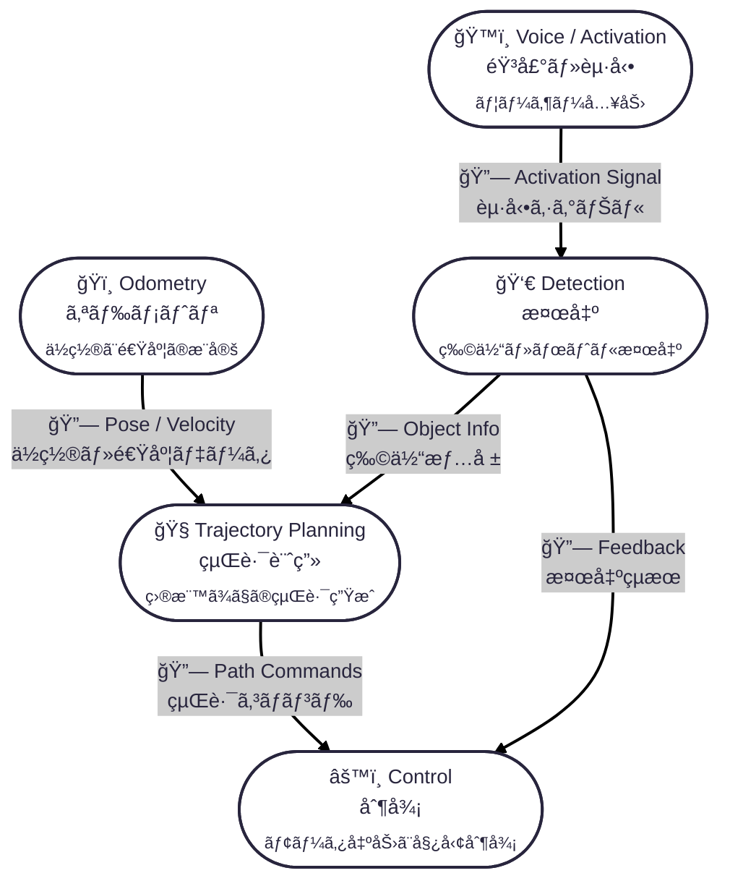

# Overview

```mermaid
---
config:
      theme: redux
---
flowchart TD
    A(["ğŸï¸ Odometry<br/>オドメトリ<br/><sub>ä½ç½®ã¨é€Ÿåº¦ã®æ¨å®š</sub>"])
    B(["🧭 Trajectory Planning<br/>経路計画<br/><sub>目標ã¾ã§ã®çµŒè·¯ç”Ÿæˆ</sub>"])
    C(["âš™ï¸ Control<br/>制御<br/><sub>モータ出力ã¨å§¿å‹¢åˆ¶å¾¡</sub>"])
    D(["👀 Detection<br/>検出<br/><sub>物体・ボトル検出</sub>"])
    E(["ğŸ™ï¸ Voice / Activation<br/>音声・起動<br/><sub>ユーザー入力</sub>"])

    A -- "🔗 Pose / Velocity<br/>ä½ç½®ãƒ»é€Ÿåº¦ãƒ‡ãƒ¼ã‚¿" --> B
    B -- "🔗 Path Commands<br/>経路コãƒãƒ³ãƒ‰" --> C
    D -- "🔗 Object Info<br/>物体情報" --> B
    E -- "🔗 Activation Signal<br/>起動シグナル" --> D
    D -- "🔗 Feedback<br/>検出çµæœ" --> C
```
